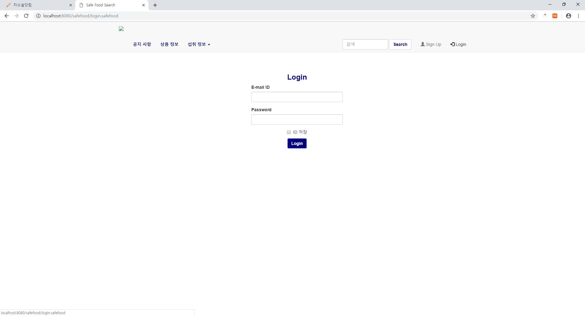
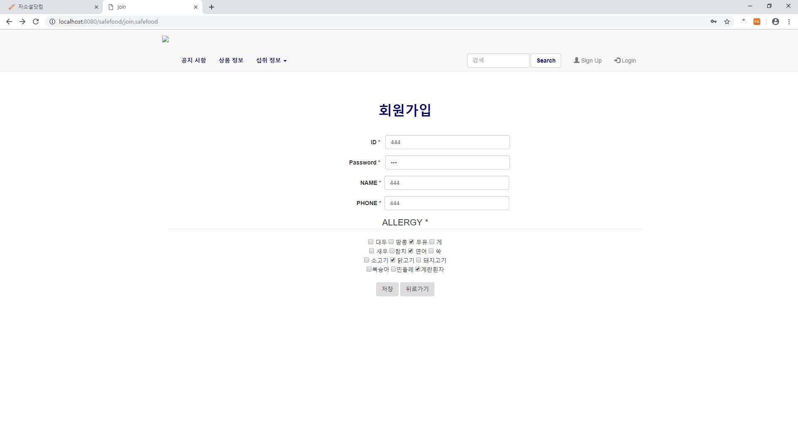
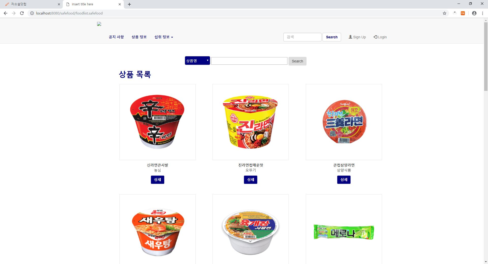
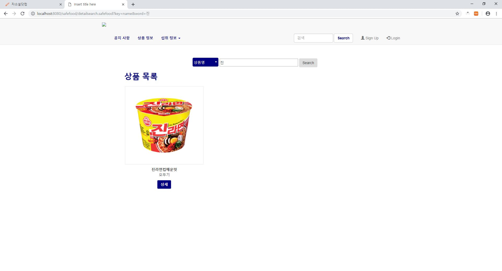
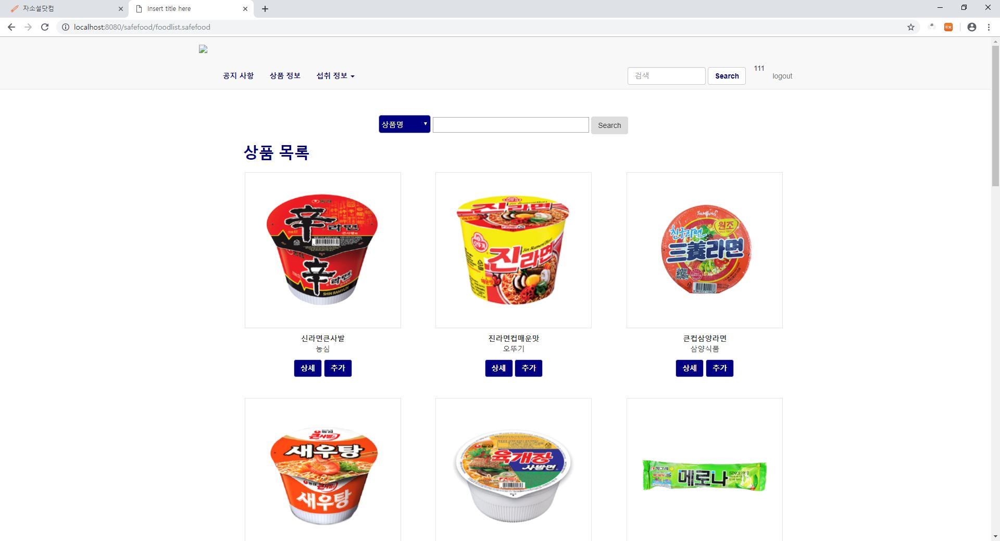
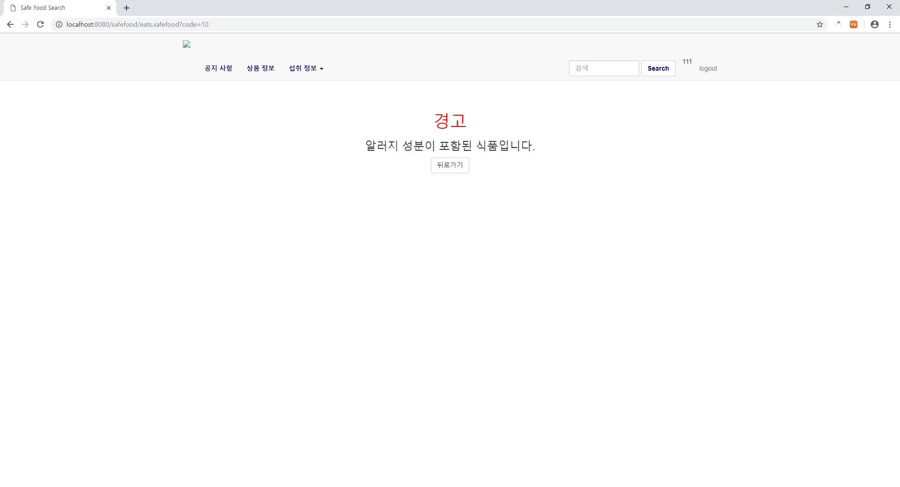
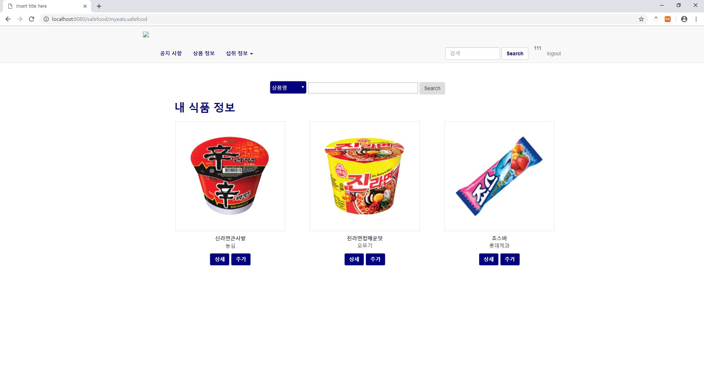
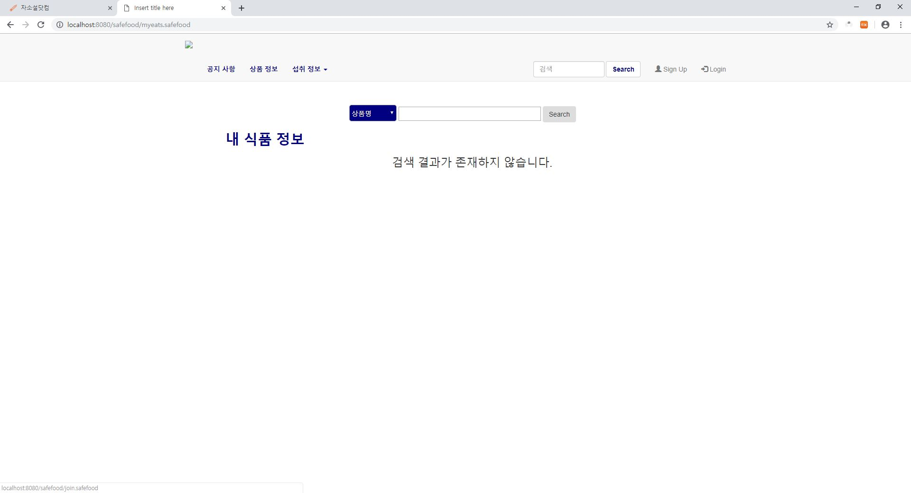
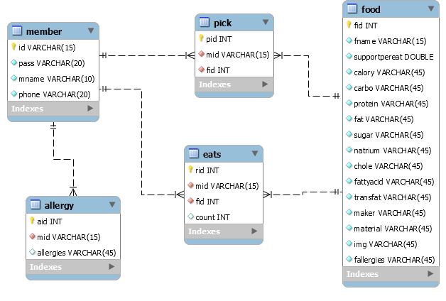

# Safefood 홈페이지 구현
- Spring MVC 구조로 구현
- DB : MySQL
- 소비자들에게 안전한 먹거리를 추천해주고 개인별로 알러지 정보를 기입하여 해당 식품이 안전하지 여부를 알려주는 홈페이지.

## 스크린 샷

<로그인 화면>

<회원가입 화면>

<전체 품목리스트>

<전체 검색 기능>

<이름명 검색 기능>

<품목리스트_로그인시 - 섭취 기능 추가>

<알러지 식품 섭취 시 경고창>

<섭취한 품목들 저장>

<섭취 품목 리스트 - 로그인 안했을 시>

## DB 구조도
